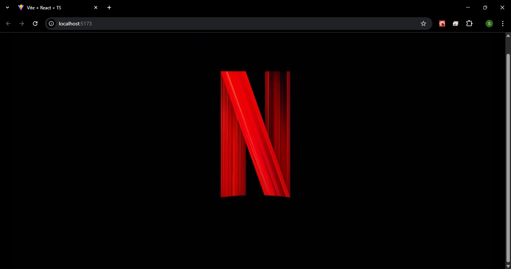
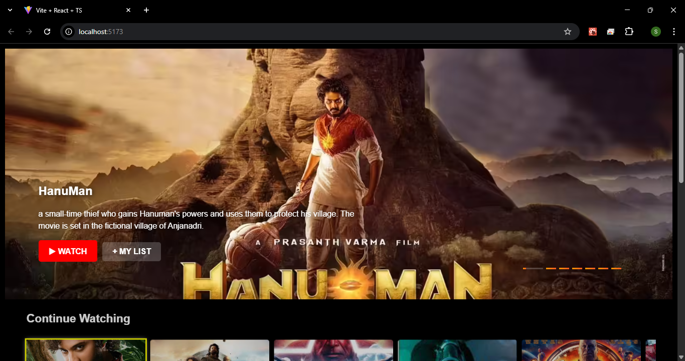
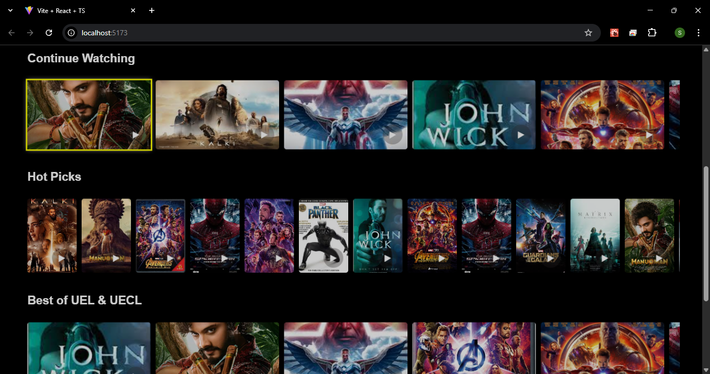
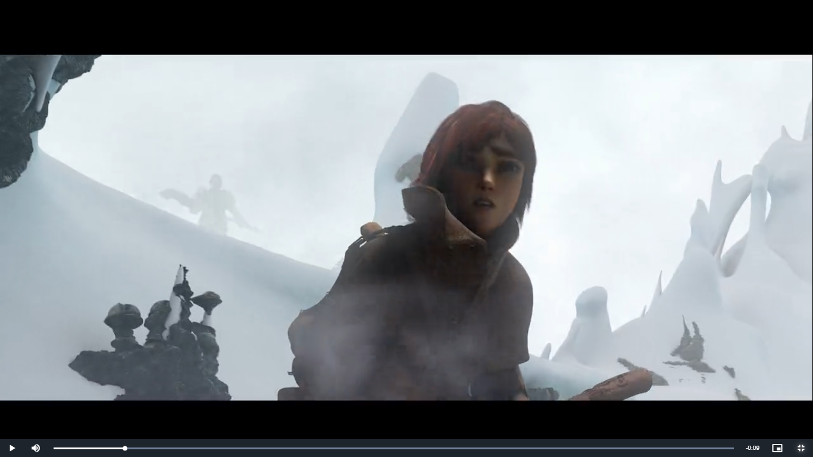
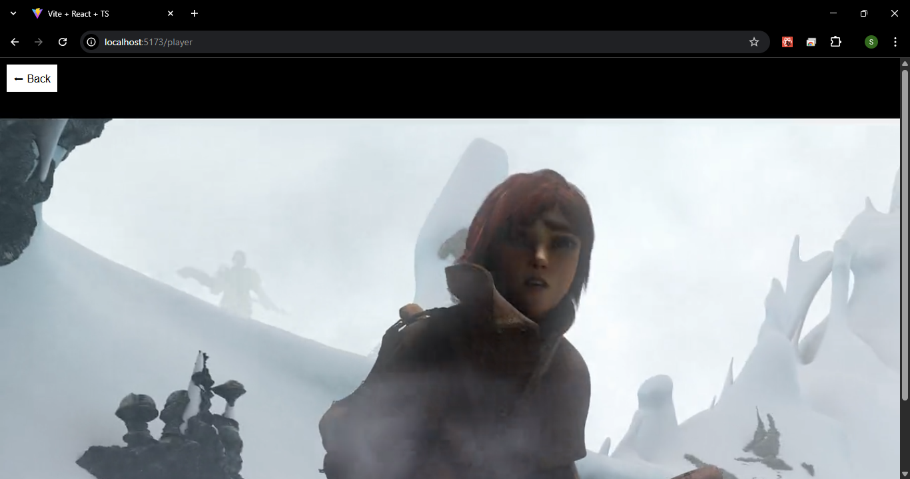
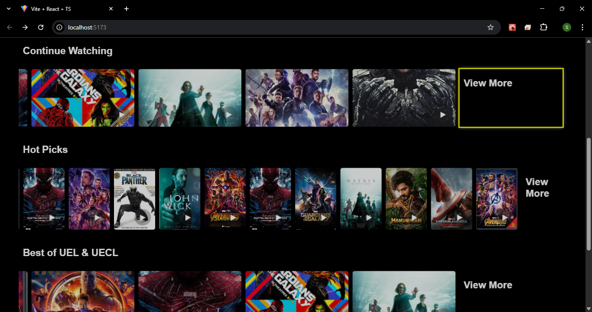
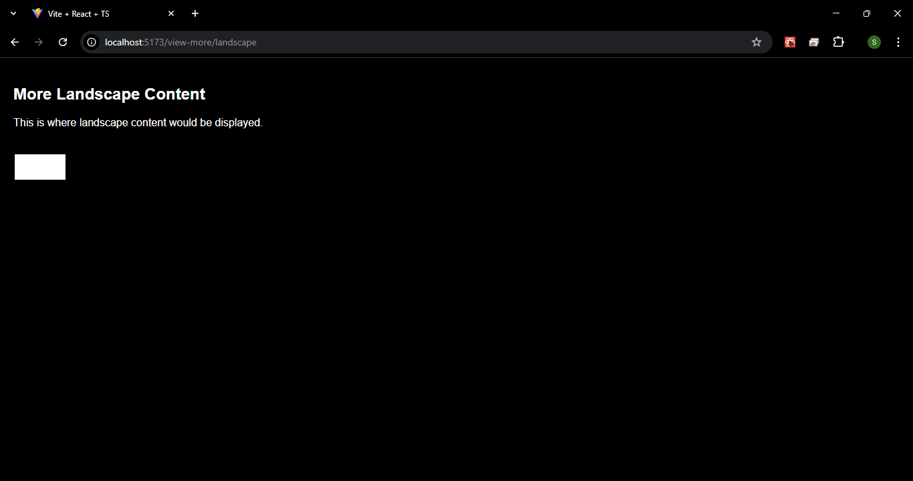
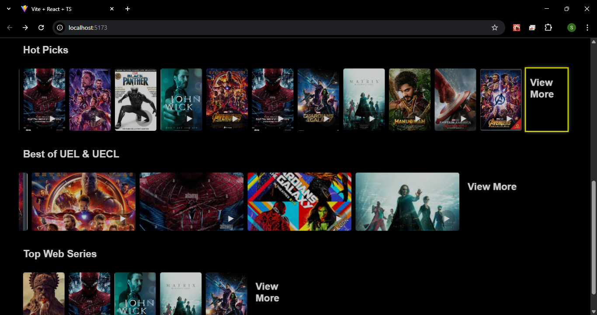
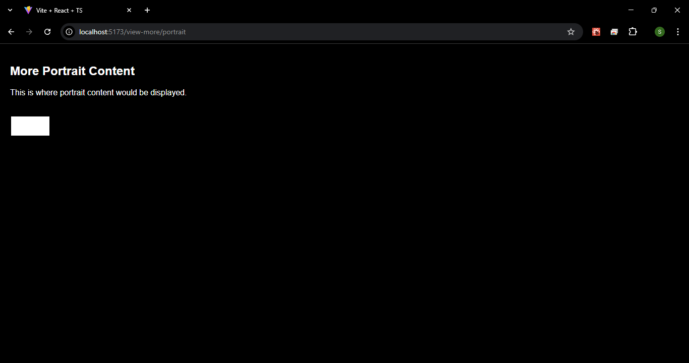

# A Smart TV OTT Platform UI

## Table of contents

- [Overview](#overview)
  - [The challenge](#the-challenge)
  - [Screenshot](#screenshot)
  - [Links](#links)
  - [Built with](#built-with)
- [Author](#author)

## Overview

This project is a **Smart TV OTT Platform UI** built with React, TypeScript, and Vite, focusing on **spatial navigation** for TV remotes and keyboard controls. It features:

- Auto-playing **carousel with countdown overlays**.
- **Portrait and landscape trays** with scalable, interactive tiles.
- Integrated **Video.js player** for seamless playback.
- Built-in **View More navigation** for extended browsing.
- **Remote navigation** with clear focus indicators.
- **Focus animations and highlighting** for clear, accessible navigation.
- **Fully responsive** for large screens & TV development pipelines.

It is designed to serve as a **production-ready base for TV or OTT application development**.

---

### The challenge

Building **TV OTT platforms** requires:
- Spatial navigation handling for arrow keys and remotes.
- Performance optimization for large screens and animations.
- Intuitive, clean UI with clear focus states.
- Seamless video playback.

This project addresses these challenges while maintaining **clean code, scalability, and developer-friendly structure**.

---

### Screenshot

> Add here:
- 
- 
- 
- 
- 
- 
- 
- 
- 

---

### Links

- [ Smart TV OTT Platform UI Live ](https://shrikanth-dev.github.io/Smart-TV-OTT-Platform-UI/) 
- [GitHub Repository](https://github.com/shrikanth-dev/Smart-TV-OTT-Platform-UI) 

---

### Built with

- **React 19**
- **TypeScript**
- **Vite**
- **Norigin Spatial Navigation**
- **Video.js**
- **React Slick Carousel**
- **React Router v7**
- **CSS transitions and focus animations**

---

## Author

- Shrikanth Dev
- [GitHub](https://github.com/shrikanth-dev)
- LinkedIn - [@G Srikanth](https://www.linkedin.com/in/g-srikanth-gs)

---
